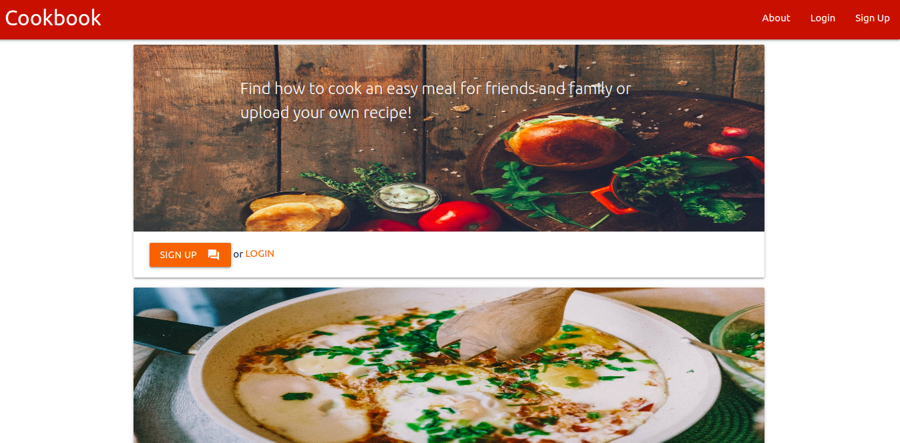
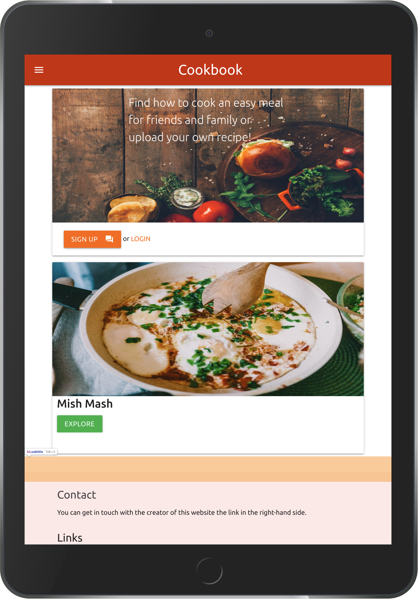
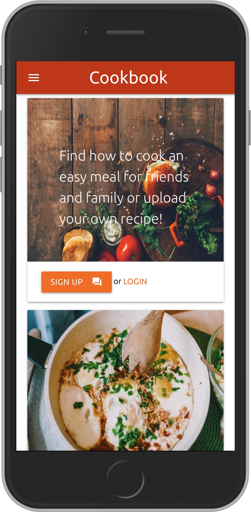

# The Cookbook Project

A Flask project for the Code Institute

This is a non-for-profit site aimed to fit the purpose for users to share and exchange simple, quick and easy-to-cook budget recipes. 
Prospective users can get added value in their daily routine by eating healthy.
Users can upload data and get familiar with the full recipe list to cook after filling login authentication form.

## Visualisation

An online version is deployed and can be checked out at this [link](insert link). This app is hosted on Heroku.
It is based on the Flask framework for Python and uses MongoDB (NoSQL Database). 

  


## User Experience

The app is meant for use by anyone with a passion for cooking, especially for people with limited time at their disposal 
but with desire to prepare a quick and comforting meal. Furthermore, allows interaction between people with limited and broad experience 
in cooking. 

Main purpose is to achieve a fast and clear result for the user. It can be done either by uploading a recipe or browsing through 
the existing content to find something easy to cook. This is achieved with a simplified design fitted for desktop and 
mobile screens. The header brings out a navbar which shrinks to a burger type collapsible menu when used on mobile. Both the header and 
the footer are designed in natural colours with emphasis on deep dark orange. 

When the user lands on the page first sees two cards with pictures. The first one provides a message what the site is about and 
links to sign up or login. The second card is a sample teaser recipe with an expand button with activator class which hints some details 
and presents the full picture of the meal. I implemented this as sort of teaser tool and presenting what are the limitations for the user 
without being logged in. After the login the user has access to a form to submit a recipe with various input fields. 
I included the culinary region to enrich the content, and make it more insteresting for the user who uploads and the user who checks 
the recipe afterwards. There is a switch button lever that which asks user to confirm 'Yes, I have cooked this meal'. It adds a human touch and
a brings more sense of reliability that a real person is behind the input.

In case the user is just visiting has an option just to check out the recipes list. Each recipe has a separate card with a picture 
and inviting buttons to find more about the recipe. The full recipe can be accessed by either clicking on the expand/view buttons or
or by clicking on the picture. 

The footer gives an option for contact the owner via social network links and provides convenient back-to-top button at the bottom right of 
the screen.

## Technologies

1. Flask
2. PyMongo
3. MongoDB
4. Heroku
5. Bcrypt
6. Python
7. JavaScript
8. HTML
9. CSS 
10. Materialize 1.0.0

## Development process

Started with coding the app.py file and linking it to the MongoDB account. The initial part of coding was based on what I have learned in 
the Code Institute. At some point adding the login authentication presented a challenge. However I received an inspiration from [this page](https://www.digitalocean.com/community/tutorials/how-to-add-authentication-to-your-app-with-flask-login) 
at Digital Ocean. It was a nice starting point and I decided to simplify it along the way. That is why I keep it one python file because
the form I use is rather basic. After exploring more details I found [this tutorial](https://www.youtube.com/watch?v=vVx1737auSE) which presented the tool how encrypt the password 
in the mongodb database. I had to fix a bug in the login process after wiring up the sign up connction. The password stays encrypted using the Bcrypt format and
I don't have access to the password of the user. 

At a later stage the media upload provided limited options. MongoDB is document based and storing pictures is not recommened. Hence, I decided 
to store the picture by converting it to a string to fit in the database. To improve the uploads each picture size is restricted to 4MB. 

The entire CSS styling was done near the end of the project. The styles of the app stick to the Materialize framework. 
In order to stick to simplified approach I tried to resort to few customised css in the static folder. Interestingly Materialize does not 
provide a validation form for the username input. Therefore I sticked to the email validation form offered by Materialize.


## Testing

### Manual Testing

The main testing was done on the login page which required some bug fixing to come up the fix in the final version of the code in line
line 87. After I need to make sure that the routing differs wheather user is in login session. Testing the CRUD framework for creation, 
read, update and delete is in place took the great part of the tests. It needed to make sure is managing the right document. If someone wants
test the page can use a imagined email like 'test@test.com' and create own password.

I used the Firefox browser and was constantly tested for content consistency with Chrome. Hence there are no additional issues 
with the compatability. After completion of the final version, a manual test for compatability were done for Safari and Microsoft Edge 
browser. The back to top button was additionally modified with line of code inside the function ```document.body.scrollTop = 0;```
to make the page compatable with the Safari browser.


## Features

The start page section indroduces the login area. It possess a navbar menu to navigate accross the sections.
Once landed on the start page the user can only read. Only after signing in in the app, user is allowed to provide input and see the recipes.
The mandatory login feature serves as a basic filter of the content. 

The share recipe section present the users with a form where can provide the recipe specifics. Before posting the recipe, 
the uploader needs to provide with the name of the recipe and region or country of origin which represents. The field do not 
have restictions for word count. Each user can provide as detailed explanation as possible. After filling the ingredients and 
a the cooking steps, it requires a photo upload. Then the user needs to submit a date of the upload. All fields have html validations. 
In the last field input before sending the recipe the user needs to confirm that had cooked the recipe. Many test users have found this feature nice
to have as it prompts some self-accountability in the user. 

After the upload, the recipe is listed in the Recipes section. There each recipe has own card consistent with the sample recipe card 
included in the landing page. There are two levels of interaction there. First one get you acquinted with the card by pictire uploaded 
in the form with buttons to find more. Second level triggers the actual recipe with the instructions and the details needed. 

### Features Left to Implement

Score rating - the button to Rate the recipe is wired up to another collection in MongoDB not related to the recipes collection. 
Still does not provide the reviews output. I indend to add a two level of scoring system, 1) score 1 to 5; 2) review text with limited 
word count. The review rating will be included in the recipe card. The average score will be visible first next to the name of the recipe.

User profile feature - such feature will take the app to the platform level and can become for profit type.Then a chatbox could be nice
 tihing to have next to each recipe card. It will be an option to ask the uploader questions. 

### Know issues

The rate button on the recipe card is not entirely wired up with the website. It has a collection in MongoDB for reviews but 
is still a feature that needs to be implemented. I indend to add it a ratings key nested in each recipe document. At this moment after the
user clicks to submit the review it returns that is under construction.

## Credits

### Content

I have written all text and published the existing recipes.
All media in the form of picteres are either my own or taken from Wikipedia and [Pexels.](https://www.pexels.com).

### Acknowledgements

The JQuery code that triggers the navbar on mobile and the datepicker form was taken from the Materialize [website.](https://materializecss.com/) 

The steps needed to add 'back to top' button were taken from [here.](https://www.w3schools.com/howto/howto_js_scroll_to_top.asp)

Guiding steps on the flask login feature can be found [here](https://www.youtube.com/watch?v=vVx1737auSE). The video tutorial
with further guiding steps can be found [here](https://www.youtube.com/watch?v=vVx1737auSE). Both served as guidance and we not
taken litterally as shown in the tutorials.


## Instalation

I used GitPod for this project and if you'ra planning to clone the repository, please start with this command:

```
https://github.com/podvistorcheto/Milestone-3.git
```

Then type these command lines in the terminal to make sure all frameworks are in place:

```pip3 install flask
   pip3 install flask_pymngo
   pip3 install dnspython
   pip3 freeze --local > requirements.txt
```

The GitPod editor doesn't ask for ```sudo``` before ```pip3``` in the commands, but most editors require it. 
I used environmental variable and secret key to connect the app with the database which are known only be my.
This Flask framework [website](https://flask.palletsprojects.com/en/1.1.x/config/) provides enough details how to create your you environmental variable and
add secret key.


